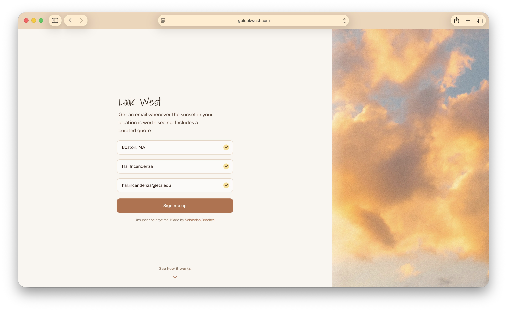

# Look West

Get an email whenever the sunset in your location is worth seeing. Includes a curated quote.



<!--
## Setup

### 1. Convex backend

```bash
npm install
npx convex dev
```

`npx convex dev` will prompt you to create a Convex project on first run, generate the `convex/_generated/` types, deploy your schema, and start watching for changes.

Copy the deployment URL it prints (e.g. `https://your-deployment.convex.cloud`) into your `.env` file as `CONVEX_URL`.

The Python sender now requires `CONVEX_ADMIN_KEY` because it calls internal Convex
functions to fetch delivery-safe user records (including unsubscribe tokens) without
exposing those tokens through the public API.

### 2. Python script

```bash
pip install -r requirements.txt
cp .env.example .env   # then fill in your API keys
```

### 3. Frontend

```bash
npm run dev
```

If you deploy the frontend anywhere other than `https://golookwest.com`, set `APP_BASE_URL`
in `.env` so unsubscribe links in email point to the correct origin.

## Usage

```bash
# Phase 1 only — check sunset quality, queue alerts
python scripts/alerts/sunset_check.py check

# Phase 2 only — send queued SMS messages
python scripts/alerts/sunset_check.py send

# Both phases in sequence (default)
python scripts/alerts/sunset_check.py run

# Test mode — bypass timing filter for a specific user
python scripts/alerts/sunset_check.py check --test-user "+16175551234"

# Run backend unsubscribe flow tests
npm run test:once
```

### Sunset scoring

Set `SUNSET_SCORER` in `.env`:

- `sunsethue` (default) — uses the SunsetHue API for professional sunset forecasts
- `openweathermap` — fallback heuristic based on cloud cover, humidity, visibility, and AQI

### Wiring up cron triggers

The Convex backend defines two cron jobs (`sunsetScoreCheck` every 15m, `sendPendingAlerts` every 5m) with placeholder actions. To connect them to this script, you can either:

1. **External cron** — use `crontab`, a systemd timer, or a cloud scheduler to run the Python script on schedule
2. **Convex actions** — replace the placeholder actions in `convex/cronActions.ts` with HTTP calls to a server running this script

### Unsubscribe flow

- Each user receives a high-entropy `unsubscribeToken` stored in Convex.
- Alert emails link to `/unsubscribe?token=...`, which renders a confirmation page.
- The page only unsubscribes after an explicit button click; it does not unsubscribe on GET.
- Re-subscribing an inactive email rotates the token so old unsubscribe links stop working.
- Static deployments include SPA rewrites for deep links via `public/_redirects` and `vercel.json`.

## Project Structure

```
convex/
├── schema.ts          # users + alerts tables
├── users.ts           # queries & mutations for user management
├── alerts.ts          # queries & mutations for sunset alerts
├── cronActions.ts     # placeholder actions for cron jobs
└── crons.ts           # sunsetScoreCheck (15m) + sendPendingAlerts (5m)

scripts/
├── alerts/
│   ├── sunset_check.py      # main script — Phase 1 (score & queue) + Phase 2 (send)
│   ├── email_renderer.py    # safe HTML email rendering
│   ├── fallback_scorer.py   # OpenWeatherMap sunset quality heuristic
│   ├── prompts.py           # LLM prompts for message generation
│   ├── preview_email.py     # dev utility — preview email in browser
│   ├── email_template.html
│   └── welcome_email_template.html
└── generate-og-image.mjs    # generates public/og-image.png
```

## Environment Variables

See `.env.example` for all required variables. Key ones:

| Variable | Description |
|---|---|
| `CONVEX_URL` | Your Convex deployment URL |
| `CONVEX_ADMIN_KEY` | Required admin/deploy key for the sender's internal Convex queries |
| `APP_BASE_URL` | Public app origin used to build unsubscribe links in email |
| `SUNSETHUE_API_KEY` | SunsetHue API key (if using sunsethue scorer) |
| `OPENWEATHERMAP_API_KEY` | OpenWeatherMap API key (if using owm scorer) |
| `TWILIO_ACCOUNT_SID` | Twilio account SID |
| `TWILIO_AUTH_TOKEN` | Twilio auth token |
| `TWILIO_FROM_NUMBER` | Twilio phone number (E.164) |
| `OPENROUTER_API_KEY` | OpenRouter API key for Claude Haiku message generation |
| `SUNSET_QUALITY_THRESHOLD` | Minimum score (0-100) to send an alert (default: 50) |
| `SUNSET_SCORER` | `sunsethue` or `openweathermap` (default: sunsethue) |
-->
